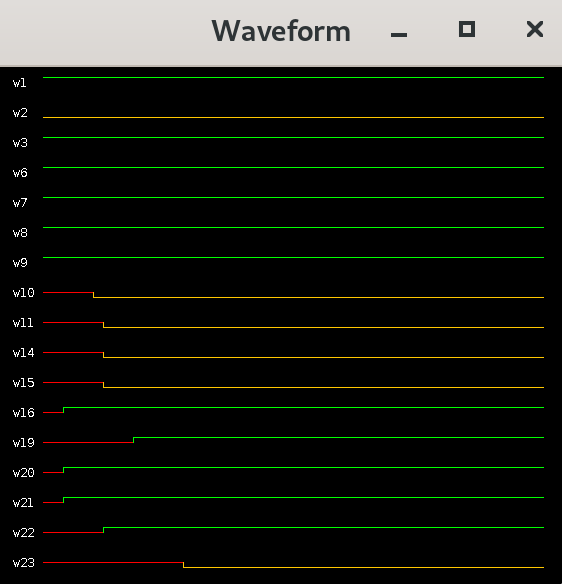

# Combinational Logic Simulator
The simulator takes a combination circuit in an ISCAS gate-level netlist format located in `resources/circuit.isc` along with test inputs located in `resources/test-inputs.txt` and simulates the propagation of the inputs against the circuit. It then generates the waveform associated with the simulation.

## Waveform
Here's an example of what the waveform looks like. It's based on the ISCAS c17 [benchmark](https://www.researchgate.net/figure/ISCAS-Benchmark-Circuit-c17_fig3_297715287).

<br/>



<br/>
Green indicates the HIGH logic, yellow the LOW logic, and red the UNKNOWN logic. 


## Install
Clone the repository and make sure you have Maven install on your system. From the root folder, run the following command to compile the project:

```
mvn install
```

It will create a `jar` file named `combinational-circuit-simulator-0.1.jar` in the target folder.


## Run 
For running the simulator, use the following command:

```
java -cp target/combinational-circuit-simulator-0.1.jar clsimulator.main.Simulator
```
